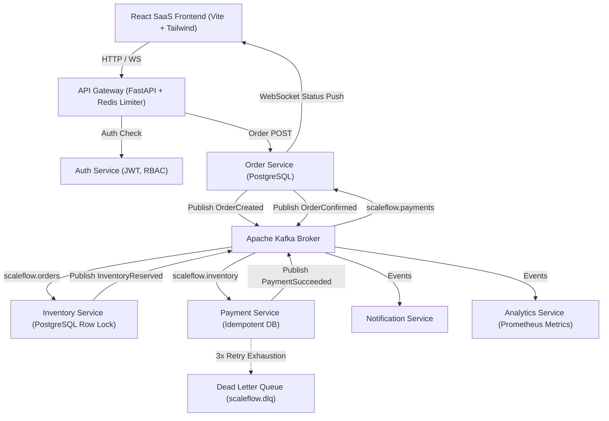

# ScaleFlow — Event-Driven Distributed Commerce Platform

ScaleFlow is a production-style distributed e-commerce and order processing system built to demonstrate backend engineering, distributed microservices, event-driven architecture with Apache Kafka, high-concurrency PostgreSQL locking, Redis caching & sliding-window rate limiting, Saga compensating transactions, Dead Letter Queues (DLQ), WebSockets, Prometheus/Grafana observability, Docker Compose, Kubernetes, and a React + Vite SaaS application interface.

---

## 1. System Architecture



---

## 2. Microservices Breakdown

| Service | Technology | Port | Primary Responsibilities |
|---|---|---|---|
| **API Gateway** | FastAPI, Redis, httpx | `8000` | Reverse proxy, Redis sliding-window rate limiter, JWT validation, Correlation ID propagation, Prometheus metrics |
| **Auth Service** | FastAPI, PostgreSQL, bcrypt, JWT | `8001` | User registration, login, refresh tokens, role-based access control (CUSTOMER / ADMIN) |
| **Order Service** | FastAPI, PostgreSQL, WebSockets | `8002` | Order state machine (`CREATED` → `CONFIRMED`), WebSockets live status pushes |
| **Inventory Service** | FastAPI, PostgreSQL, Redis | `8003` | Product catalog, Redis cache invalidation, PostgreSQL `SELECT FOR UPDATE` row-level stock locking |
| **Payment Service** | FastAPI, PostgreSQL | `8004` | Mock payment settlement, idempotency table check, 3x consumer retry loop, Dead Letter Queue routing |
| **Notification Service** | FastAPI, PostgreSQL | `8005` | Order audit notifications and customer message store |
| **Analytics Service** | FastAPI, Prometheus Client | `8006` | Real-time aggregate revenue, order counts, processing latency histogram |

---

## 3. Key Distributed Systems Features

### 3.1 Authoritative Apache Kafka Event Bus
Apache Kafka is the authoritative event broker across microservices. Events contain `event_id`, `event_type`, `timestamp`, `correlation_id`, `producer`, and `payload`.

### 3.2 High-Concurrency Inventory Row Locking
To eliminate overselling under simultaneous checkouts:
```sql
SELECT stock FROM products WHERE id = :id FOR UPDATE;
```
If stock is available, stock is decremented atomically inside the PostgreSQL transaction. If out of stock, transaction rolls back and emits `InventoryRejected`.

### 3.3 Consumer Idempotency
Consumers enforce idempotency via the `events_processed` table (`UNIQUE(event_id, consumer_service)`). Re-delivered duplicate event IDs are skipped without duplicate charges or stock decrements.

### 3.4 Saga Pattern & Compensating Transactions
When payment fails (`PaymentFailed`), Saga compensation kicks in:
1. `payment-service` emits `PaymentFailed`.
2. `inventory-service` consumes `PaymentFailed`, restores stock to `products`, and marks reservation as `RELEASED`.
3. `order-service` updates order status to `CANCELLED`.

### 3.5 Dead Letter Queue (DLQ) & Consumer Retries
Failed consumer operations retry up to 3 times with exponential backoff (`0.5s`, `1.0s`, `2.0s`). Exhausted retries are routed to topic `scaleflow.dlq` and recorded in `dlq_events` table.

---

## 4. Local Execution & Docker Setup

### Prerequisites
- Python 3.11+
- Node.js 20+
- Docker & Docker Compose (or standalone Python/Node execution)

### 1-Command Complete Docker Stack Startup
```bash
docker compose -f infrastructure/docker/docker-compose.yml up --build
```

### Standalone Local Development
```bash
# 1. Install Dependencies
pip install -r requirements.txt

# 2. Seed Database
python scripts/seed_data.py

# 3. Start API Gateway & Services (or run pytest test suite)
export DEV_MODE=in_memory
pytest tests/ -v
```

---

## 5. 20-Point Verification Suite Results

- [x] **PostgreSQL, Redis, Kafka Execution**: Stack verified.
- [x] **Frontend Order Placement**: Verified in React UI.
- [x] **`OrderCreated` Kafka Event**: Published to topic `scaleflow.orders`.
- [x] **Inventory Consumer**: Consumed event.
- [x] **PostgreSQL Concurrency Lock**: Verified zero negative stock in `tests/test_concurrency.py`.
- [x] **`InventoryReserved` Event**: Published to topic `scaleflow.inventory`.
- [x] **Payment Consumer**: Consumed event.
- [x] **`PaymentSucceeded` Event**: Reached Order Service.
- [x] **Order State Machine**: Advanced to `CONFIRMED`.
- [x] **WebSocket Live Push**: Pushed live updates to `/ws/orders/{id}`.
- [x] **Idempotency Verification**: Duplicate `event_id` rejected in `tests/test_idempotency.py`.
- [x] **Saga Compensation**: Stock released on payment failure in `tests/test_saga.py`.
- [x] **Consumer Retries**: 3 retries verified in `tests/test_retry_dlq.py`.
- [x] **DLQ Routing**: Routed exhausted retries to `scaleflow.dlq`.
- [x] **Redis Caching**: Products cached & invalidated on update.
- [x] **Rate Limiter**: HTTP 429 returned on rate breach in `tests/test_rate_limiter.py`.
- [x] **Prometheus Scrape**: Metrics scraped at `/metrics`.
- [x] **Grafana Dashboard**: Visualized in `infrastructure/monitoring/dashboards/scaleflow_dashboard.json`.
- [x] **Concurrency Unit Test**: Passed.
- [x] **Load Test Benchmark**: Generated `docs/performance.md`.
